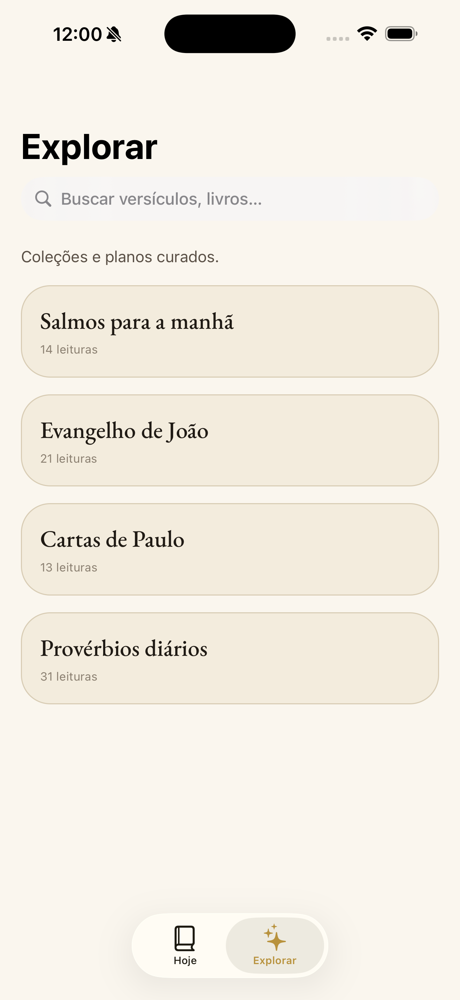

<div align="center">
  
  <h1>Logos AI</h1>
  <p><strong>Leitura bíblica diária, reflexão e oração em uma experiência pessoal.</strong></p>
  <p>Aplicativo mobile que cria planos de leitura por tema, organiza a jornada diária e gera conteúdo devocional com apoio de IA.</p>
</div>

## Visão geral

O Logos AI foi criado para tornar a leitura bíblica mais consistente e contextual. No onboarding, o usuário escolhe um tema, define a duração do plano e configura um lembrete. A partir disso, o aplicativo apresenta diariamente uma passagem, uma reflexão e uma oração.

Os textos bíblicos são armazenados no próprio dispositivo com SQLite. Isso mantém as passagens disponíveis localmente, enquanto a geração dos planos e conteúdos personalizados é feita por funções remotas.

## Telas

<div align="center">
  
  &nbsp;&nbsp;
  
</div>

## Funcionalidades

- Planos de leitura por temas como ansiedade, gratidão, perdão, fé e esperança.
- Passagem, reflexão e oração organizadas em uma jornada diária.
- Geração de planos e conteúdo devocional por IA.
- Bíblia armazenada localmente com Expo SQLite.
- Lembretes diários por notificações locais.
- Temas claro, escuro e automático.
- Compartilhamento da reflexão como texto ou imagem.
- Área de exploração com coleções e planos curados.

## Tecnologias

- React Native 0.81 e React 19
- Expo 54 e Expo Router 6
- TypeScript em modo estrito
- NativeWind e Tailwind CSS
- Expo SQLite e React Native MMKV
- Supabase Edge Functions
- Expo Notifications

## Executando localmente

### Pré-requisitos

- Node.js e npm
- Xcode para executar no iOS
- Android Studio para executar no Android
- Projeto Supabase com as funções `generate-plan` e `generate-daily`

### Instalação

```bash
git clone <url-do-repositorio>
cd app-logos
npm install
```

Crie um arquivo `.env.local` na raiz:

```env
EXPO_PUBLIC_SUPABASE_URL=https://seu-projeto.supabase.co
EXPO_PUBLIC_SUPABASE_ANON_KEY=sua-chave-anon
EXPO_PUBLIC_PRIVACY_EMAIL=privacidade@seu-dominio.com
```

Gere e abra uma build de desenvolvimento:

```bash
npm run ios
# ou
npm run android
```

Para iniciar novamente o Metro após a primeira build:

```bash
npm start
```

Outros comandos úteis:

```bash
npm run web          # inicia a versão web
npm run lint         # executa o ESLint
npm run fetch:bible  # baixa novamente o dataset bíblico
```

## Estrutura do projeto

```text
app/          Rotas, onboarding e telas principais
components/   Componentes visuais reutilizáveis
hooks/        Hooks compartilhados
lib/          Bíblia, banco local, planos, IA e notificações
theme/        Cores, tipografia, espaçamento e tokens
assets/       Ícones, capturas e dataset bíblico
scripts/      Utilitários executados durante o desenvolvimento
```

## Dados bíblicos e licença

O arquivo `assets/bible/aa.json` é incorporado ao aplicativo e indexado no SQLite durante a primeira execução. Ele pode ser atualizado com `npm run fetch:bible`.

> A fonte padrão usada pelo script é um dataset comunitário com licença não esclarecida. Antes de distribuir o aplicativo, substitua-o por uma tradução com licença compatível e documentada.

## Status

Projeto em desenvolvimento. Consulte [AGENTS.md](AGENTS.md) para as convenções de contribuição do repositório.
